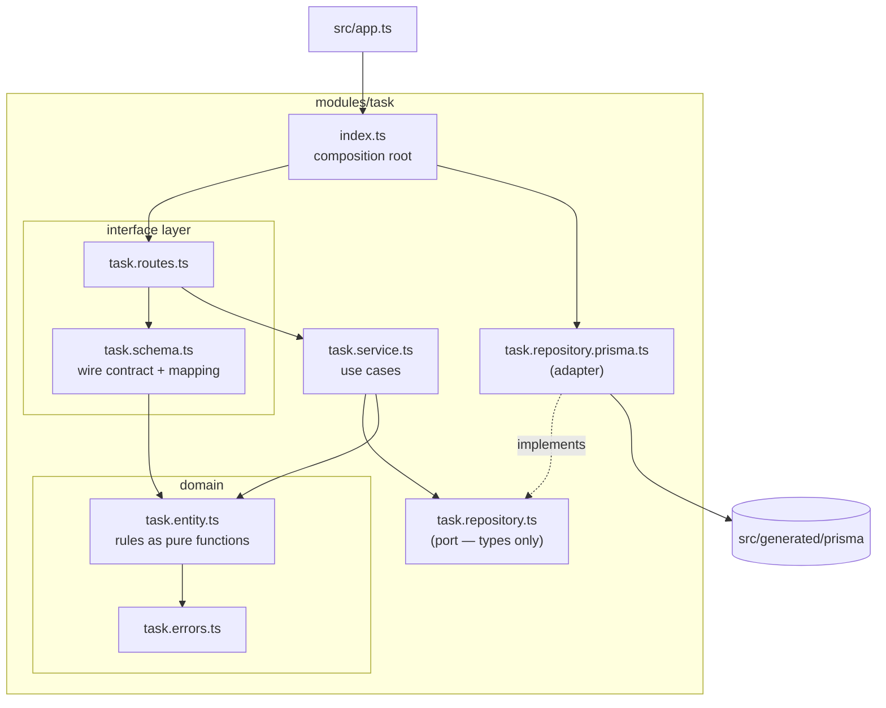

# Architecture

This template applies the load-bearing ideas of **Clean Architecture** — the
dependency rule, ports and adapters, a framework-free core — through
**Fastify's own composition model** (plugins, decorators, encapsulation),
organized as **vertical feature modules** rather than horizontal global layers.

Every rule on this page is enforced by `npm run boundaries`
(dependency-cruiser). If a rule below is not tool-enforceable, it says so.

---

## 1. The shape: vertical modules, layered inside

A feature lives in one folder under `src/modules/`. The clean-architecture
layering exists **inside** the module, not as app-wide `domain/`, `adapters/`,
`drivers/` trees:

```
modules/task/
├── index.ts                   composition root
├── task.routes.ts   ┐
├── task.schema.ts   ┘         interface layer (Fastify + Zod)
├── task.service.ts            application layer (use cases)
├── task.repository.ts         port
├── task.repository.prisma.ts  adapter (Prisma)
├── task.entity.ts   ┐
└── task.errors.ts   ┘         domain (pure TypeScript)
```



### The dependency rule

Dependencies point downward only. Per file-role (matched by filename, checked
by dependency-cruiser):

| Layer (file)                       | May import                                               | Must never import                                                 |
| ---------------------------------- | -------------------------------------------------------- | ----------------------------------------------------------------- |
| `*.entity.ts`, `*.errors.ts`       | each other, `lib/errors`, `lib/clock`, `lib/pagination`  | **anything else** — no npm package, no Fastify, no Zod, no Prisma |
| `*.repository.ts` (port)           | domain files, pure lib                                   | frameworks, adapters, services                                    |
| `*.ports.ts` (outbound ports)      | domain files, pure lib                                   | frameworks, adapters, services                                    |
| `*.service.ts`                     | domain, ports, other services in its module, pure lib    | Fastify, Zod, Prisma, adapters, routes, schemas, plugins          |
| `*.repository.prisma.ts` (adapter) | domain, its port, `src/generated/prisma`, pure lib       | Fastify, services, routes, schemas                                |
| `*.storage.s3.ts` (adapter)        | domain, its ports, `@aws-sdk/*`, node builtins, pure lib | Fastify, Prisma, services, routes, schemas                        |
| `*.routes.ts`, `*.schema.ts`       | everything in the module except the adapter; `lib`       | Prisma, other modules                                             |
| `index.ts`                         | everything in its module                                 | other modules' internals                                          |

Cross-cutting rules, also enforced:

- **Modules are islands.** No module imports another module's files. Shared
  code moves to `lib/`; a module that offers a capability to others decorates
  the Fastify instance (see [docs/recipes.md](docs/recipes.md)).
- **Prisma appears in exactly three places**: `*.repository.prisma.ts`
  adapters, `src/plugins/database.ts` (lifecycle), and the type augmentation.
  Tests are exempt — factories seed through Prisma deliberately.
- **The AWS SDK appears in exactly three places** — same shape: `*.storage.s3.ts`
  adapters, `src/plugins/s3.ts` (lifecycle), the type augmentation; tests exempt.
- **Adapters are instantiated only in a composition root** (`index.ts`).
  Everything else programs against the port.
- `lib/` imports nothing above itself; `plugins/` never import modules.

### The composition roots

`src/app.ts` composes the application: infrastructure plugins first, then
modules with their mount prefixes, in an order you read top to bottom. Each
module's `index.ts` composes the module: adapter → service → routes. These are
the only places that know which concrete implementation is used — swapping
PostgreSQL for something else is a new adapter file plus one changed line in
`index.ts`.

### Publishers and consumers (cross-module use)

Modules never import each other, yet capabilities flow between them — as
runtime values on the Fastify instance:

- A **publisher** module (`modules/user`, `modules/task`) decorates the
  instance with its service (`fastify.decorate("userService", service)`).
  Publishing changes the module's shape: it is wrapped in `fastify-plugin` so
  the decoration escapes encapsulation, and it therefore mounts its own route
  prefix internally. Decorations are typed once in `src/types/fastify.d.ts`
  — the one app-level file allowed to import module types.
- A **consumer** module (`modules/onboarding`) declares the slice it needs as
  **consumer-owned ports** in its own `*.ports.ts` (types only, enforced),
  and its `index.ts` wires `fastify.userService` into its service. TypeScript
  verifies _structurally_, at that line, that the published service satisfies
  the port — no shared interface file, no import between the modules.
- `app.ts` registers publishers before consumers; entities still never cross
  the boundary — ids and plain inputs do.

`modules/onboarding` is the live reference: one user action that spans three
modules (mark user onboarded → create welcome task) with zero cross-module
imports, unit-tested with five-line port fakes.

### Outbound infrastructure: plugin → port → adapter

External systems (object storage, cache, mail, payments) always split into the
same three pieces — the live reference is the avatar upload in `modules/user`:

| Piece       | File                              | Owns                                                                                                                    |
| ----------- | --------------------------------- | ----------------------------------------------------------------------------------------------------------------------- |
| **Plugin**  | `src/plugins/s3.ts`               | The raw client's lifecycle only: create from config, `decorate("s3")`, destroy on close. No buckets, no logic.          |
| **Port**    | `modules/user/user.ports.ts`      | _What_ the module needs, in its own vocabulary: `AvatarStorage.uploadAvatar(...)`. No SDK words.                        |
| **Adapter** | `modules/user/user.storage.s3.ts` | _How_ that maps to the technology: bucket, key layout, `PutObjectCommand`. The only module file importing `@aws-sdk/*`. |

`index.ts` introduces them (`createS3AvatarStorage(fastify.s3, config.S3_AVATARS_BUCKET)`),
the service consumes only the port, and unit tests substitute an in-memory
`AvatarStorage` (`test/helpers/in-memory-avatar-storage.ts`).

Two rules keep this honest:

- **Purpose in the port, technology in the adapter.** A port method named
  `uploadToAvatarsBucket` has already leaked S3 into the domain even with
  clean imports; the port says `uploadAvatar`, the adapter knows about
  buckets. The `.storage.s3.ts` suffix carries the tech instead.
- **No dead SDKs.** The integration lane runs the real adapter against MinIO
  (S3-compatible, started by Testcontainers in `test/int/setup/minio.ts`),
  so the S3 path is exercised on every run with no AWS account — the same
  standard as the database.

---

## 2. The three shapes of data

One kind of object per boundary. TypeScript's structural typing does the
conversion work cheaply, but the _types_ stay separate because the boundaries
change for different reasons.

| #   | Kind            | Lives in                | Built with                    | Purpose                                                                                        |
| --- | --------------- | ----------------------- | ----------------------------- | ---------------------------------------------------------------------------------------------- |
| 1   | **Wire shape**  | `*.schema.ts`           | Zod                           | The public HTTP contract: what is validated in and serialized out, and what OpenAPI documents. |
| 2   | **Domain type** | `*.entity.ts`           | plain `type` + pure functions | The business object and its rules. The service's input/output vocabulary.                      |
| 3   | **Row**         | Prisma generated client | `schema.prisma`               | The shape of a database row. A persistence detail.                                             |

Hard rules:

- A **request body type never reaches a service.** Routes hand the service its
  own declared input type (`CreateTaskInput`). Today they are structurally
  identical — the point is that when they diverge, only the route changes.
- A **service never returns a wire shape.** It returns domain types;
  `toTaskResponse()` in `*.schema.ts` is the one place a `Task` becomes JSON
  (dates → ISO strings).
- A **row never leaves the adapter.** `toTask()` maps it at the boundary;
  `select`/`where`/query mechanics are decided in the adapter, not the service.

The enforceable parts (imports) are covered by the boundary rules above; the
"which type flows where" part is a review-time rule, kept honest by the
service's explicit input/output types.

### One request, end to end

`POST /api/tasks/:id/complete`:

```
HTTP request
  → taskParamsSchema            (Zod: well-formed id?)
  → service.completeTask(id)    (application: orchestrate)
      → repository.findById     (port)
          → Prisma adapter      → SELECT → row → toTask() → Task
      → completeTask(task)      (domain: archived? already done?)
      → repository.save         (port) → UPDATE
  → toTaskResponse(task)        (wire: Dates → ISO strings)
HTTP 200 — or 404/409 mapped from the domain error by the error-handler plugin
```

---

## 3. Errors

Errors are raised in domain vocabulary and translated to HTTP in exactly one
place.

| Where                          | What                                                                                                                                                                                              | Example                                   |
| ------------------------------ | ------------------------------------------------------------------------------------------------------------------------------------------------------------------------------------------------- | ----------------------------------------- |
| `src/lib/errors.ts`            | The vocabulary: `AppError` base with a `code` union (`NOT_FOUND`, `CONFLICT`, `UNPROCESSABLE`, `UNAUTHORIZED`, `FORBIDDEN`). No status codes.                                                     | —                                         |
| `modules/*/​*.errors.ts`       | Named errors subclassing the vocabulary, message baked in at the definition.                                                                                                                      | `TaskArchivedError extends ConflictError` |
| `src/plugins/error-handler.ts` | The **only** place status codes exist: `code → status` table, plus validation errors (400), Fastify plugin errors (e.g. 429), and the unknown-error 500 that logs everything and reveals nothing. | —                                         |

Every failing response has the same body: `{ "message": "..." }`.

Rules of thumb:

- A library exception must not escape the adapter that caused it — translate
  it (see `save()` catching Prisma's P2025 → `TaskNotFoundError`).
- Services and entities `throw new SomethingError()` — they never see a status
  code and never format a response.
- Messages live with the error class that owns them, not in a global catalog;
  the `code` union is the hook if per-locale mapping is ever needed at the
  edge.

---

## 4. Tests

| Suite           | Location                                      | Runs against                                  | Needs   |
| --------------- | --------------------------------------------- | --------------------------------------------- | ------- |
| Domain          | `test/unit/task.entity.test.ts`               | entity functions directly                     | nothing |
| Use cases       | `test/unit/task.service.test.ts`              | in-memory repository + fixed clock            | nothing |
| DB adapter      | `test/int/task.repository.prisma.test.ts`     | real PostgreSQL                               | Docker  |
| Storage adapter | `test/int/user.storage.s3.test.ts`            | real S3 API (MinIO)                           | Docker  |
| HTTP            | `test/int/task.routes.test.ts`, `app.test.ts` | the real app via `inject()` + real PostgreSQL | Docker  |

Two design points carry the strategy:

1. **The in-memory repository is a genuine implementation of the port, not a
   mock** (`test/helpers/in-memory-task-repository.ts`). It honors the same
   contract the Prisma adapter honors (ordering, cursor semantics), and the
   adapter integration tests verify that contract against the real database.
   Unit tests therefore exercise real code paths — there is no
   mocking framework in this template at all.
2. **Config is a value**, so `buildTestApp({ DOCS_PASSWORD: "secret" })` can
   exercise config-dependent behavior without touching `process.env`.

The integration lane (`test/int/setup/`) boots one throwaway Postgres and one
MinIO per run via Testcontainers, applies the migration SQL once to a template
database, clones one database per Vitest worker, and TRUNCATEs between tests
(workers share the MinIO bucket safely — avatar keys are unique per upload).
Write integration tests accordingly:

- **Arrange with factories** (`test/int/factories/`), never with other tests.
- **Never hardcode ids** — TRUNCATE restarts sequences; read ids off the row
  the factory returns.
- **A journey lives in one `it`** — the truncate runs between cases.

---

## 5. What this template deliberately does NOT do

Recorded so they are choices, not accidents. The long version of each is an
ADR in [docs/adr/](docs/adr/).

- **No DI container** (ADR-0002). Explicit wiring in two small composition
  roots replaces Awilix: the object graph is compiler-checked, "find all
  references" works, and no generator is needed to keep wiring safe.
- **No global horizontal layers** (ADR-0001). `use_cases/`-style top-level
  trees scale by layer; modules scale by feature. Deleting a feature is
  deleting a folder.
- **No entity classes / no mandatory DTO ceremony** (ADR-0003). Domain =
  types + pure functions; conversions exist only where representations
  actually differ (wire ↔ domain ↔ row).
- **No dead code — infrastructure is either exercised or absent.** The S3
  integration ships because every line of it runs against MinIO in the
  integration lane; auth, transactions and typed JSON columns remain
  documented patterns in [docs/recipes.md](docs/recipes.md) until a project
  needs them. Never keep an SDK that no test exercises.
- **No pagination-free lists.** Every list endpoint is cursor-paginated from
  day one (`lib/pagination.ts`).
- **No unit-of-work abstraction.** Each repository method is atomic; when one
  use case must commit across repositories, add a transactional port then
  (recipe included) rather than passing ORM sessions around now.

---

## 6. Adding a feature

Work inside-out; the boundaries hold you to it (`npm run check`).

1. **Domain** — `<name>.entity.ts` + `<name>.errors.ts`: types, rules, named
   errors. Unit-test them directly.
2. **Port** — `<name>.repository.ts`: the narrowest interface the use cases
   need, in domain vocabulary.
3. **Service** — `<name>.service.ts`: use cases against the port + clock.
   Unit-test with an in-memory port implementation.
4. **Schema** — `schema.prisma` model + `npm run prisma:migrate:create`
   (review the SQL) + `apply`; then the adapter
   `<name>.repository.prisma.ts` with its `toX()` mapper, and an integration
   test for the contract.
5. **Interface** — `<name>.schema.ts` (wire shapes + `toXResponse`) and
   `<name>.routes.ts` (schemas on routes, thin inline handlers).
6. **Compose** — `index.ts` wires adapter → service → routes; register the
   module with its prefix in `src/app.ts`.
7. `npm run check && npm run test:int`.

The `task` module is the reference implementation of all six steps.
